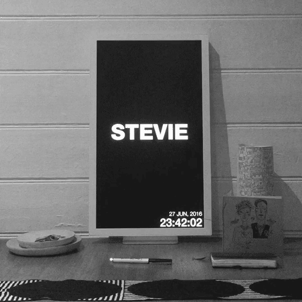

# Pop Clock


[http://codeoncanvas.cc/popclock](http://codeoncanvas.cc/popclock)

Pop Clock makes the hard decisions for you.

Its super simple - give it a list, set a frequency and the clock will tick through your options.

You can use it to periodically decide what you should be doing.
```
http://codeoncanvas.cc/popclock/?list=eat,sleep,code,repeat&seconds=2
```

We're using it to choose the name of our new baby! (Hence the Pop in the title) We have a shortlist of names that we like but figured it would be nice for the baby to make the final decision based on the time its born :)

[http://codeoncanvas.cc/popclock?list=pascale,pia,stevie,holiday&seconds=60](http://codeoncanvas.cc/popclock?list=pascale,pia,stevie,holiday&seconds=60)

